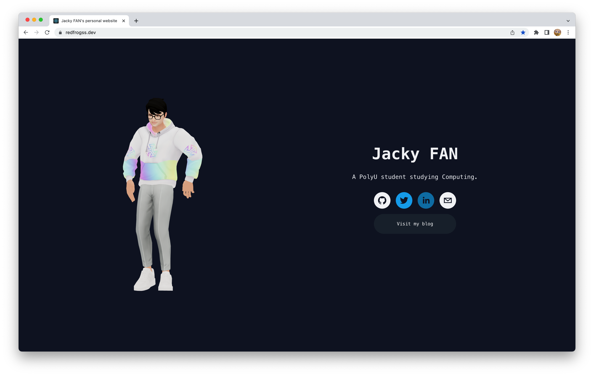
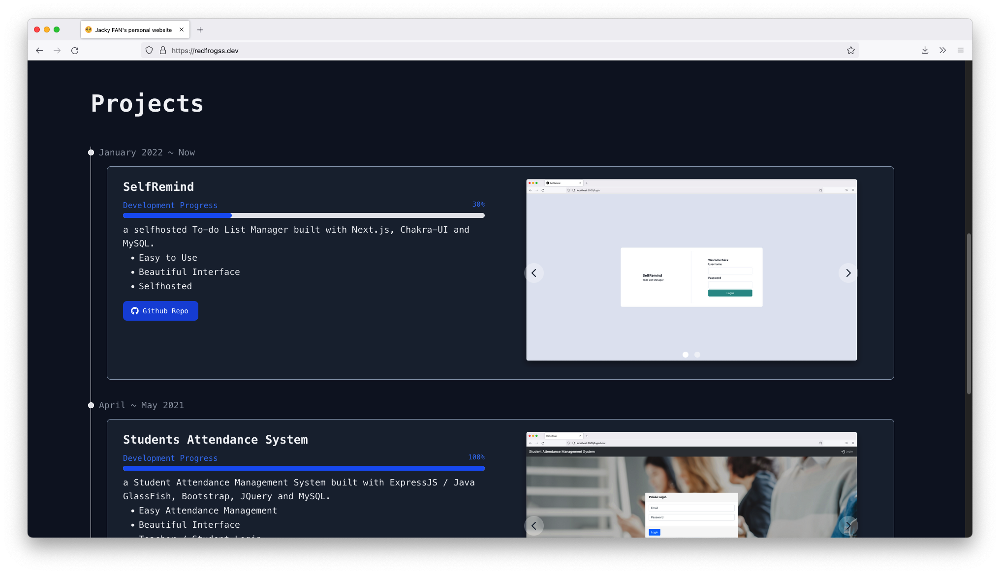

[](https://www.codefactor.io/repository/github/redfrogsss/redfrogss.dev)

# redfrogss.dev - My Personal Website
[redfrogss.dev](https://redfrogss.dev) - My Personal Website built with [ReactJS](https://reactjs.org/), [TailWindCSS](https://tailwindcss.com/) and [Three.JS](https://threejs.org/).

## Screenshots



## Get Started with `yarn`
- To start the development build, do this in your terminal:
```
yarn;
yarn start
```

- To deploy the production build, do this in your terminal:
```
yarn deploy
```

## Learn More

This website is built by [Jacky Fan](https://github.com/redfrogsss).

The following tech is used in this project.
- [ReactJS](https://reactjs.org/) - the framework of this project.
- [tailwindcss](https://tailwindcss.com/) - the UI framework of this project.
- [Flowbite](https://flowbite.com/) - the UI components of this project.
- [Three.js](https://threejs.org/) - the 3D model renderer of this project.
- [Ready Player Me](https://readyplayer.me/) - the free-to-use 3D avatar model of this project.
- [Mixamo](https://www.mixamo.com/) - the 3D animation tool of this project.
- [Framer Motion](https://www.framer.com/motion/) - the motion library of this project.

The following tutorial is used in this project.
- [How to Use Three.js And React to Render a 3D Model of Your Self](https://dev.to/nourdinedev/how-to-use-threejs-and-react-to-render-a-3d-model-of-your-self-4kkf)

You can check out [my dirty code in Github](https://github.com/redfrogsss/redfrogss.dev).
